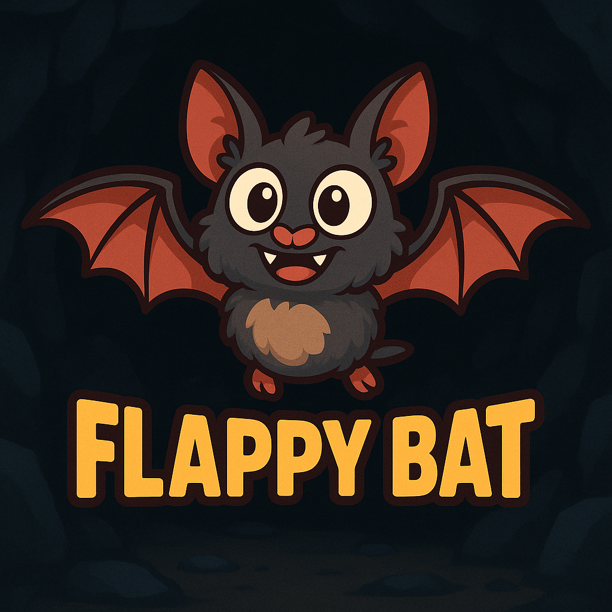

# Flappy Bat

  

A simple flappy bat game built with HTML5 Canvas and JavaScript.

*Created with Amazon Q Developer - AI-powered coding assistant*

## Game Overview

- **Genre**: Side-scrolling 2D Arcade
- **Character**: Bat
- **Controls**: SPACEBAR → Flap wings (fly up)
- **Physics**: Automatic gravity (fall down)
- **Obstacles**: Rock pillars with gaps
- **Environment**: Moving rocky cave

## How to Play

1. **Start Game**: Press SPACEBAR to begin
2. **Control Bat**: Press SPACEBAR to flap wings and fly up
3. **Avoid Obstacles**: Navigate through gaps between rock pillars
4. **Score Points**: Each obstacle passed increases your score
5. **Game Over**: Collision with rocks, ceiling, or floor ends the game
6. **Restart**: Press R after game over to play again

## Game Features

- **Fullscreen Display**: Responsive design that fills the entire browser window
- **Realistic Physics**: Gravity and momentum-based flight with destructible rocks
- **Scrolling Cave**: Moving rocky ceiling and floor
- **Random Obstacles**: Procedurally generated rock pillars
- **Score System**: Track obstacles successfully passed
- **Visual Graphics**: Custom bat and rock sprites
- **Smooth Animation**: 60 FPS game loop
- **Countdown Timer**: 3-second countdown before game starts
- **Dynamic Rock Physics**: Rocks break into individual pieces when hit
- **Realistic Destruction**: Rock pieces fall with gravity and bounce realistically
- **Sound Effects**: Immersive audio including wing flaps, collisions, and explosions
- **Debug Mode**: Visual collision area display (disabled by default)
- **Precise Collision**: Accurate collision detection matching visual rock boundaries

## Game Assets

### Images
- **Bat Sprite**: [bat.png](./docs/images/bat.png)
- **Rock Texture**: [rock.png](./docs/images/rock.png)
- **Game Logo**: [game.png](./docs/images/game.png)

### Sound Effects
- **Wing Flap**: [Bat_takeoff.ogg](./docs/sounds/Bat_takeoff.ogg)
- **Idle Sounds**: Bat_idle1-4.ogg (4 variations)
- **Pain Sounds**: Bat_hurt1-3.ogg (3 variations)
- **Explosion Effects**: Explosion1-4.ogg (4 variations)

## Source Code

- **Game Logic**: [game.js](./docs/game.js)
- **HTML Page**: [index.html](./docs/index.html)

## How to Run

1. Open `docs/index.html` in a web browser
2. Press SPACEBAR to start playing
3. Enjoy the game!

## Game Mechanics

### Basic Physics
- **Screen Size**: 800x600 pixels (fullscreen display)
- **Bat Size**: 40x30 pixels
- **Jump Force**: -8 velocity units
- **Gravity**: 0.5 acceleration per frame (bat), 0.3 (rock pieces)
- **Obstacle Speed**: 3 pixels per frame
- **Rock Width**: 80 pixels
- **Gap Size**: 180 pixels between rock pillars
- **Spawn Rate**: New obstacle every 90 frames (~1.5 seconds)

### Collision & Destruction
- **Collision Detection**: Precise collision matching visual boundaries
- **Rock Destruction**: Individual 45-pixel rock pieces with physics
- **Top Rock Behavior**: Falls and scatters on collision
- **Bottom Rock Behavior**: Tips over in collision direction
- **Ground Contact**: Rock pieces settle on cave floor (30px from bottom)
- **Friction**: 0.7 coefficient when pieces hit ground

### Audio System
- **Wing Flap**: Plays on every SPACEBAR press
- **Game Start**: Random idle sound after countdown
- **Collision**: Simultaneous hurt + explosion sounds
- **Volume**: All sounds at 50% volume

## Development

This game was developed using **Amazon Q Developer**, an AI-powered coding assistant that helped with:
- Game logic implementation
- Advanced physics and collision detection
- Dynamic rock destruction system
- Image rendering and animation
- Audio system integration
- Score tracking system
- Code optimization and debugging

## Technical Features

### Rock Physics Engine
- Individual rock pieces with unique physics properties
- Realistic gravity, rotation, and collision mechanics
- Dynamic destruction based on collision direction
- Ground friction and settling behavior

### Sound System
- Multiple audio file format support (.ogg)
- Random sound selection for variety
- Audio error handling and fallback
- Optimized audio loading and playback

### Visual Effects
- Real-time rock breaking animation
- Smooth 60 FPS rendering
- Debug mode for collision visualization
- Responsive canvas scaling
