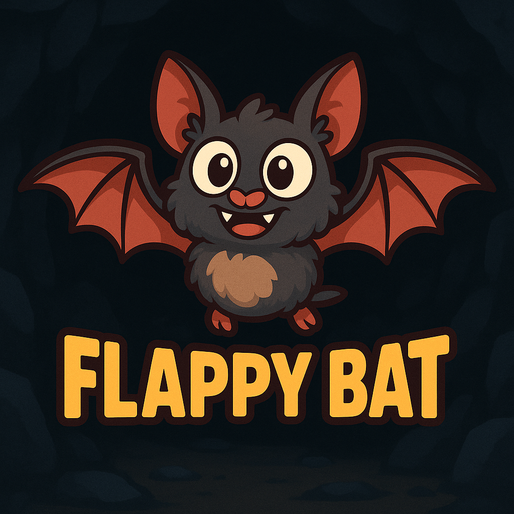

# Flappy Bat - Phaser Edition

  
   
  <a href="https://nalbam.github.io/games/flappy-bat-phaser/">🎮 게임 플레이</a>

Phaser.js 3 게임 엔진을 사용하여 제작된 개선된 박쥐 동굴 탐험 게임입니다.

*Claude Code - AI 코딩 어시스턴트로 제작*

## 게임 개요

- **장르**: 피버 모드가 있는 횡스크롤 2D 아케이드 액션
- **캐릭터**: 4가지 형태의 박쥐 (일반, 펄럭임, 피버, 죽음)
- **조작**: 스페이스바/클릭/터치로 날개 펄럭이기
- **물리 엔진**: Phaser.js 아케이드 물리로 현실적인 중력과 관성 구현
- **장애물 시스템**: 거리 기반 스폰, 충돌 시 물리적 붕괴 효과
- **환경**: 스크롤링 동굴 배경 (천장과 바닥 바위)
- **특별 기능**: 거리 기반 횃불 스폰, 피버 모드, 파티클 이펙트

## 게임 방법

### 🎮 조작법
- **데스크톱**: 스페이스바 또는 클릭으로 날개 펄럭이기
- **모바일**: 화면 터치로 날개 펄럭이기
- **재시작**: 게임 오버 후 R키 누르기 또는 클릭/터치

### 🎯 게임플레이

#### 기본 조작
1. **게임 시작**: 스페이스바, 클릭, 또는 터치로 시작
2. **박쥐 조작**:
   - 스페이스바/클릭/터치로 날개 펄럭이기 (위로 가속)
   - 놓으면 중력에 의해 박쥐가 아래로 떨어짐
   - 박쥐 각도가 속도에 따라 자동 조정

#### 게임 메커닉
3. **거리 추적 시스템**: 실시간 거리 계산 및 표시 (미터 단위)
4. **장애물 스폰**: 15미터마다 거리 기반으로 바위 기둥 생성
5. **횃불 시스템**: 150미터마다 피버 모드 아이템 생성
6. **물리적 붕괴**: 충돌 시 바위가 현실적으로 무너지고 흩어짐

#### 피버 모드 (10초 지속)
7. **활성화**: 횃불 수집 시 자동 발동
8. **변화**:
   - 박쥐 크기 1.5배 증가 (0.4 → 0.6 스케일)
   - 모든 오브젝트 이동 속도 2배 증가 (400 → 800)
   - 바위 충돌 시 파괴 (무적 + 폭발 이펙트)
   - 노란색 피버 바 및 "FEVER MODE!" 텍스트 표시
   - 화면 플래시 이펙트

#### 점수 및 진행
9. **점수 시스템**: 각 바위 기둥을 통과할 때마다 1점 증가
10. **게임 오버**: 바위, 천장, 바닥 충돌 시 (피버 모드 제외)
11. **재시작**: R키 또는 화면 클릭으로 완전 초기화 후 재시작

## 게임 에셋

### 이미지
- **박쥐 스프라이트**:
  - [bat1.png](./images/bat1.png) - 날개 펼친 상태 (300x223) - 활공/낙하
  - [bat2.png](./images/bat2.png) - 날개 접은 상태 (300x223) - 점프/펄럭임
  - [bat_dead.png](./images/bat_dead.png) - 죽은 상태 (300x317) - 게임 오버
  - [bat_fever.png](./images/bat_fever.png) - 피버 모드 (400x353) - 파워업 상태
- **파워업 아이템**:
  - [torch.png](./images/torch.png) - 피버 모드 트리거 (170x300)
- **환경**:
  - [rock.png](./images/rock.png) - 파괴 가능한 바위 텍스처 (300x286)
  - [game.png](./images/game.png) - 게임 로고 (1024x1024)

### 사운드 이펙트
- **날개 펄럭임**: [Bat_takeoff.ogg](./sounds/Bat_takeoff.ogg) - 점프/펄럭임 소리
- **파워업 사운드**: Bat_idle1-4.ogg (4가지 변형) - 횃불 수집 및 게임 시작
- **충돌 사운드**: Bat_hurt1-3.ogg (3가지 변형) - 바위 충돌 피해
- **파괴 효과**: Explosion1-4.ogg (4가지 변형) - 바위 부서지는 소리

## 기술적 특징

### Phaser.js 3 게임 엔진 활용
- **Scene 기반 구조**: GameScene 클래스로 게임 로직 캡슐화
- **아케이드 물리**: 중력, 충돌, 바운스, 드래그 효과
- **오디오 관리**: 다중 사운드 배열로 랜덤 재생
- **애니메이션**: 트윈 기반 스프라이트 애니메이션
- **파티클 시스템**: 폭발 이펙트용 커스텀 파티클

### 게임 상태 관리
- **3단계 상태**: start → playing → gameOver
- **거리 기반 스폰**: 타이머 대신 플레이어 이동 거리로 오브젝트 생성
- **메모리 최적화**: 화면 밖 오브젝트 자동 제거
- **완전 초기화**: 재시작 시 모든 오브젝트와 이벤트 정리

### 반응형 디자인
- **스케일링**: Phaser.Scale.FIT으로 비율 유지 자동 크기 조정
- **4:3 비율**: 1600x1200 해상도로 모든 디바이스 대응
- **터치 지원**: 마우스와 터치 이벤트 통합 처리

## 소스 코드

- **게임 엔진**: [game.js](./game.js) - Phaser.js 3 기반 메인 게임 로직 (751줄)
  - GameScene 클래스: 게임 상태, 물리, 렌더링 관리
  - 거리 기반 스폰 시스템
  - 피버 모드 메커닉
  - 완전한 메모리 관리 및 정리
- **웹 페이지**: [index.html](./index.html) - 반응형 모바일 최적화 페이지
  - CSS 미디어 쿼리로 디바이스별 최적화
  - Phaser.js 3.70.0 CDN 로딩
  - 픽셀 퍼펙트 렌더링 설정
