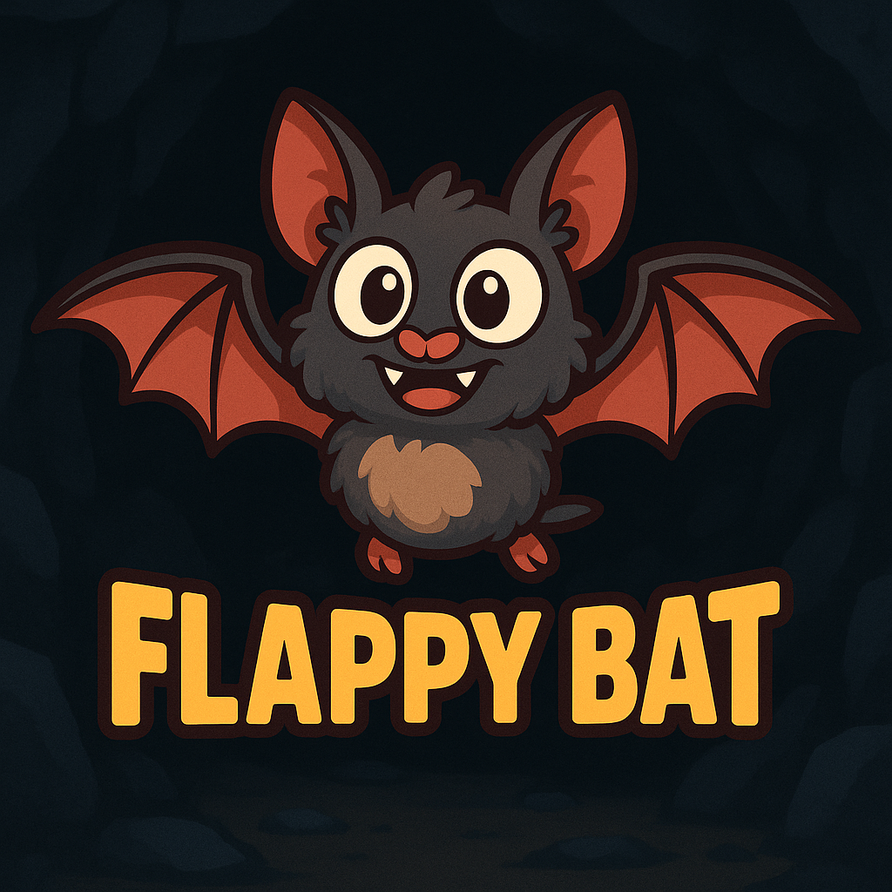

# Flappy Bat 3D

  
   
  <a href="https://nalbam.github.io/games/flappy-bat-three/">🎮 게임 플레이</a>

Three.js로 구현된 3D 플래피 배트 게임입니다.

*Claude Code - AI 코딩 어시스턴트로 제작*

## 게임 개요

- **장르**: 3D 횡스크롤 아케이드 게임
- **캐릭터**: 날개를 펄럭이는 3D 박쥐
- **조작법**: 클릭/터치/스페이스바 → 날개 펄럭이기 (위로 날기)
- **물리 엔진**: 현실적인 중력과 관성 기반 비행
- **장애물**: 3D 원통형 파이프 장애물
- **환경**: 3D 동굴 환경과 안개 효과
- **특별 기능**: 3D 모델링과 그림자 효과
- **성능**: 모든 플랫폼에서 부드러운 60 FPS

## 게임 플레이 방법

### 🎮 조작법
- **데스크톱**: 스페이스바 또는 클릭으로 날개 펄럭이기
- **모바일**: 화면 터치로 날개 펄럭이기
- **재시작**: 게임 오버 후 클릭/터치로 재시작

### 🎯 게임플레이
1. **게임 시작**: 스페이스바, 클릭 또는 터치로 게임 시작
2. **박쥐 조작**:
   - 스페이스바, 클릭 또는 터치로 날개를 펄럭여 위로 날기
   - 놓으면 중력에 의해 아래로 떨어짐
3. **장애물 피하기**: 3D 파이프 사이의 틈을 통과하며 날아가기
4. **점수 획득**: 각 장애물을 통과할 때마다 점수 증가
5. **게임 오버**: 파이프, 천장, 바닥과 충돌하면 게임 종료
6. **재시작**: 게임 오버 후 클릭하여 다시 시작

### 📱 모바일 최적화
- 모든 기기에서 작동하는 반응형 디자인
- 스마트폰과 태블릿을 위한 터치 조작
- iOS와 Android에 최적화된 성능
- 전체 화면 게임플레이 경험

## 게임 특징

### 🎮 핵심 게임플레이
- **전체 화면 디스플레이**: 브라우저 창을 가득 채우는 반응형 디자인
- **크로스 플랫폼 성능**: Windows, Mac, iOS, Android에서 60 FPS 고정
- **고급 3D 물리**: Three.js 기반 중력, 관성, 3D 충돌 감지
- **3D 박쥐 모델**: 날개와 몸체를 가진 3D 박쥐 캐릭터
- **동적 3D 환경**: 안개 효과와 조명이 있는 3D 동굴

### 🎨 시각적 & 오디오 효과
- **3D 애니메이션**: 실시간 날개 펄럭임 애니메이션
- **3D 장애물**: 원통형 파이프와 캡이 있는 3D 장애물
- **그림자 효과**: 실시간 그림자 매핑과 조명 효과
- **몰입형 오디오**: 날개 소리, 충돌음, 효과음
- **카메라 추적**: 박쥐를 따라가는 부드러운 카메라 움직임
- **반응형 UI**: 점수 표시와 게임 상태 인터페이스

### 🛠️ 기술적 특징
- **Three.js 엔진**: 최신 WebGL 기반 3D 렌더링
- **실시간 3D 렌더링**: 60 FPS 3D 그래픽
- **정밀한 3D 충돌**: 3D 바운딩 박스 충돌 감지
- **모바일 최적화**: iOS와 Android를 위한 성능 튜닝
- **오디오 시스템**: 성능 최적화된 사운드 시스템
- **메모리 관리**: 효율적인 3D 객체 관리와 정리

## 게임 에셋

### 이미지
- **박쥐 스프라이트**:
  - [bat1.png](./images/bat1.png) - 날개 펼친 상태 (300x223) - 활공/낙하
  - [bat2.png](./images/bat2.png) - 날개 접은 상태 (300x223) - 점프/펄럭임
  - [bat_dead.png](./images/bat_dead.png) - 죽은 상태 (300x317) - 게임 오버
  - [bat_fever.png](./images/bat_fever.png) - 피버 모드 (400x353) - 파워업 상태
- **파워업 아이템**:
  - [torch.png](./images/torch.png) - 피버 모드 트리거 (170x300)
- **환경**:
  - [rock.png](./images/rock.png) - 파괴 가능한 바위 텍스처 (300x286)
  - [game.png](./images/game.png) - 게임 로고 (1024x1024)

### 사운드 효과
- **날개 소리**: [Bat_takeoff.ogg](./sounds/Bat_takeoff.ogg) - 점프/펄럭임 소리
- **파워업 사운드**: Bat_idle1-4.ogg (4가지 변형) - 토치 수집 및 게임 시작
- **충돌 사운드**: Bat_hurt1-3.ogg (3가지 변형) - 바위 충돌 피해
- **파괴 효과**: Explosion1-4.ogg (4가지 변형) - 바위 파괴 소리

## 소스 코드

- **게임 로직**: [game.js](./game.js) - Three.js 기반 3D 게임 엔진과 물리, 충돌 감지, 렌더링
- **HTML 페이지**: [index.html](./index.html) - 모바일 최적화된 반응형 웹 페이지

## 실행 방법

### 🌐 온라인으로 플레이
방문: **https://nalbam.github.io/games/flappy-bat-three/**

### 💻 로컬에서 실행
1. 이 저장소를 클론하세요
2. 웹 브라우저에서 `docs/flappy-bat-three/index.html`를 열어주세요
3. 스페이스바, 클릭 또는 터치로 게임을 시작하세요
4. 게임을 즐기세요!

## 게임 메커니즘

### 기본 3D 물리
- **화면 크기**: 전체 화면 (반응형 3D 뷰포트)
- **박쥐 3D 모델**:
  - 몸체: 0.3 x 0.2 x 0.1 단위 (3D 박스)
  - 날개: 0.15 x 0.05 x 0.3 단위 (좌우 각각)
- **점프력**: 0.04 속도 단위
- **중력**: -0.002 가속도 (프레임당)
- **게임 속도**: 0.02 단위 (프레임당)
- **파이프 규격**:
  - 반지름: 0.3 단위
  - 높이: 5 단위
  - 간격: 4 단위 (파이프 사이)
  - 생성 간격: 2 단위 갭
- **3D 경계**: 위아래 4 단위 제한

### Fever Mode Mechanics
- **Activation**: Collect torch (spawns every 10 obstacles)
- **Torch Size**: 51x90 pixels (170x300 source ratio)
- **Duration**: 300 frames (5 seconds at 60 FPS)
- **Effects**: Giant size, 4x speed, invincibility to rocks
- **Visual Timer**: Real-time countdown bar display

### Animation System
- **Normal Mode Animations**:
  - Jump: Wings spread (bat1) → Wings folded (bat2)
  - Falling: Wings spread for gliding
  - Idle: Natural wing flapping cycle (20 frames)
  - Rapid Input: Faster wing animation on consecutive jumps
  - Timing: 12 frames (normal), 8 frames (rapid)
- **Fever Mode**: Giant bat_fever sprite with enhanced visual effects
- **Death Animation**: bat_dead sprite with rotation effects

### Collision & Destruction
- **Collision Detection**: Precise collision matching visual boundaries
- **Rock Destruction**: Individual 90-pixel rock pieces with realistic physics
- **Normal Mode**: Collision with rocks causes game over + rock destruction
- **Fever Mode**: Collision destroys rocks but bat continues (invincible)
- **Rock Physics**:
  - Top rocks: Fall and scatter on collision
  - Bottom rocks: Tip over in collision direction
  - Ground settling: Pieces settle on cave floor (60px from bottom)
  - Friction: 0.7 coefficient when pieces hit ground
  - Rotation: Individual piece rotation with momentum

### Audio System
- **Wing Flap**: Plays on every jump input (SPACEBAR/Click/Touch)
- **Game Start**: Random idle sound after countdown
- **Normal Collision**: Simultaneous hurt + explosion sounds (game over)
- **Fever Collision**: Explosion sound only (no hurt sound, continues playing)
- **Torch Collection**: Random idle sound for power-up feedback
- **Performance**: 50ms throttling to prevent audio overlap on mobile
- **Volume**: All sounds at 50% with mobile optimization

## Code Architecture

### Core Systems
- **Game Loop**: 60 FPS fixed frame rate with requestAnimationFrame
- **Physics Engine**: Gravity (1.0), jump velocity (-16), rock physics (0.3 gravity)
- **Collision Detection**: Precise bounding box collision with margin adjustments
- **Animation System**: State-based sprite animation with timing controls
- **Audio Engine**: Performance-optimized sound system with throttling (50ms)

### Key Components
- **Bat Object**: Position, velocity, animation states, fever mode properties
- **Rock System**: Dynamic obstacle generation with destructible physics
- **Torch System**: Power-up spawning every 10 obstacles at random positions
- **Particle System**: Rock destruction with individual piece physics
- **Mobile Optimization**: Responsive canvas scaling and touch controls

### Technical Implementation
- **Canvas Rendering**: High-resolution (1600x1200) with device pixel ratio scaling
- **Asset Management**: Progressive image loading with loading screen
- **Input Handling**: Cross-platform (keyboard, mouse, touch) event management
- **State Management**: Game states (start, countdown, playing, game over)
- **Performance**: Mobile-optimized rendering and audio throttling

## Development

This game was developed using **Claude Code**, an AI-powered coding assistant that helped with:
- Game logic implementation and architecture design
- Advanced physics and collision detection systems
- Dynamic rock destruction with realistic particle physics
- Multi-state bat animation system with timing controls
- High-resolution canvas rendering and mobile optimization
- Cross-platform audio system with performance throttling
- Responsive design and touch input handling
- Fever mode power-up system with visual feedback
- Asset loading pipeline and error handling mechanisms
- Code optimization and performance tuning for mobile devices

## Technical Features

### Rock Physics Engine
- Individual rock pieces with unique physics properties
- Realistic gravity, rotation, and collision mechanics
- Dynamic destruction based on collision direction
- Ground friction and settling behavior

### Sound System
- Multiple audio file format support (.ogg)
- Random sound selection for variety
- Audio error handling and fallback
- Optimized audio loading and playback

### Visual Effects
- Real-time rock breaking animation
- Dynamic bat wing animations
- Smooth 60 FPS rendering
- Asset loading screen with progress indicator
- Debug mode for collision visualization
- Responsive canvas scaling

### Recent Updates

#### Version 2.0 - Fever Mode Update
- **🔥 Fever Mode System**: Complete power-up system with torch collection
  - Giant bat transformation (2x size, 4x speed)
  - Invincibility to rock collisions with destruction effects
  - Visual timer bar and "FEVER MODE!" display
  - 5-second duration with real-time countdown
- **🎨 New Visual Assets**:
  - bat_fever.png (400x353) - Giant fever mode sprite
  - bat_dead.png (300x317) - Renamed from batx with proper scaling
  - torch.png (170x300) - Power-up collectible item
- **⚡ Enhanced Performance**:
  - 60 FPS locked frame rate across all platforms (Windows, Mac, iOS, Android)
  - Advanced audio throttling system (50ms) for mobile optimization
  - Improved collision detection with dynamic bat sizing
- **🎮 UI Improvements**:
  - Restart button with click/touch detection
  - Fever mode timer bar and status display
  - Enhanced game over screen with better UX
- **🔧 Technical Enhancements**:
  - High-resolution rendering (1600x1200 internal resolution)
  - Cross-platform input handling (keyboard, mouse, touch)
  - Memory-optimized asset management
  - Responsive canvas scaling for all devices

#### Previous Updates
- **Bat Animation System**: Dynamic wing animations with accurate aspect ratios
- **Physics Engine**: Realistic rock destruction with individual piece physics
- **Audio System**: Immersive sound effects with mobile optimization
- **크로스 플랫폼 지원**: 성능 최적화를 통한 범용 호환성
